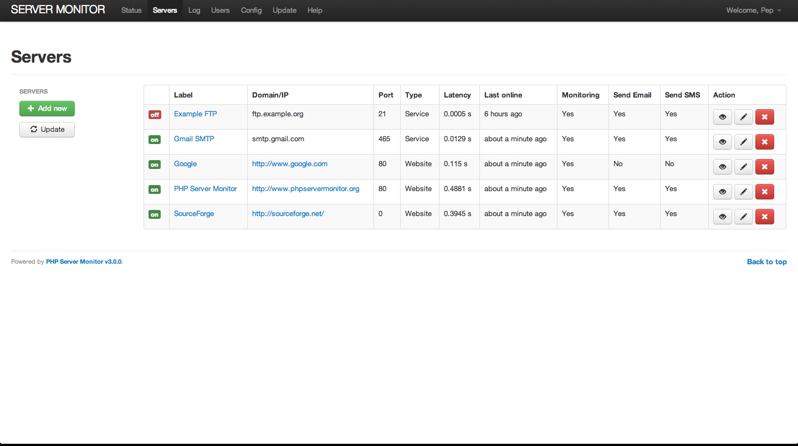

<!--
N.B.: This README was automatically generated by https://github.com/YunoHost/apps/tree/master/tools/README-generator
It shall NOT be edited by hand.
-->

# PHP Server Monitor for YunoHost

[](https://dash.yunohost.org/appci/app/phpservermon)    
[](https://install-app.yunohost.org/?app=phpservermon)

*[Lire ce readme en français.](./README_fr.md)*

> *This package allows you to install PHP Server Monitor quickly and simply on a YunoHost server.
If you don't have YunoHost, please consult [the guide](https://yunohost.org/#/install) to learn how to install it.*

## Overview

Script that checks whether your websites and servers are up and running

**Shipped version:** 3.5.2~ynh4


## Screenshots



## Disclaimers / important information

#### Multi-user support

* LDAP and HTTP auth are not supported.
* The app can be used by multiple users.

## Documentation and resources

* Official app website: www.phpservermonitor.org
* Official user documentation: https://yunohost.org/apps
* Official admin documentation: http://docs.phpservermonitor.org/en/latest/
* Upstream app code repository: https://github.com/phpservermon/phpservermon/
* YunoHost documentation for this app: https://yunohost.org/app_phpservermon
* Report a bug: https://github.com/YunoHost-Apps/phpservermon_ynh/issues

## Developer info

Please send your pull request to the [testing branch](https://github.com/YunoHost-Apps/phpservermon_ynh/tree/testing).

To try the testing branch, please proceed like that.
```
sudo yunohost app install https://github.com/YunoHost-Apps/phpservermon_ynh/tree/testing --debug
or
sudo yunohost app upgrade phpservermon -u https://github.com/YunoHost-Apps/phpservermon_ynh/tree/testing --debug
```

**More info regarding app packaging:** https://yunohost.org/packaging_apps